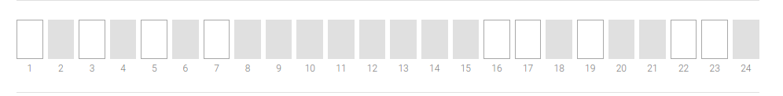

<h2 align="center">Password Input</h2>

<br>

## Wymagana wiedza

- React, HTML, CSS

## Technologie potrzebne do zadania

- React, HTML, CSS

## Cele główne

- [ ] Twoim zadaniem jest odtworzyć komponent ze zdjęcia poniżej
- [ ] Zasady działania komponentu:

* na podstawie przekazanego prop `password` komponent generuje, pojedyńcze inputy w liczbie długości hasła (8 znaków = 8 inputów). Hasło powinno mieć co najmniej długość 8 znaków
* komponent blokuje losowe inputy, i pozostawia aktywne losowe pola. Aktywnych pól powinno być maksymalnie połowę długości hasła a minimalnie 2
* jesli uzytkownik w aktywne inputy, wpisze odpowiednie hasło, wtedy wywołany zostaje prop `onSuccess` np. komunikat o poprawnym haśle pod inputami, w przeciwnym wypadku użytkownik ma otrzymać komunikat o nieprawidłowym haśle.

## Cele dodatkowe

- [ ] Niech każdy wpisany znak będzie ukryty np. czarna kropka/gwiazdka, a obok całego inputa będzie checkbox, który po zaznaczeniu pokaże znaki, a po odznaczeniu ponownie ukryje.

## Kawałek kodu dla lepszego początku!

```javascript
const PasswordInput = ({ password, onSuccess }) => {
  // return ...
};
```


